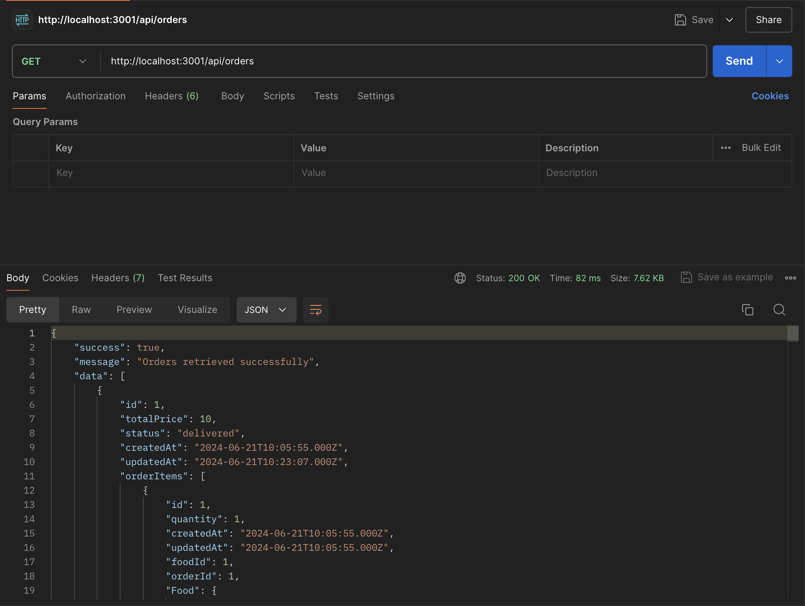
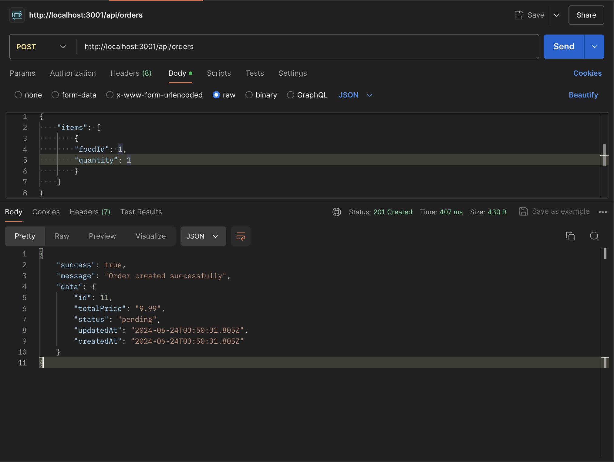
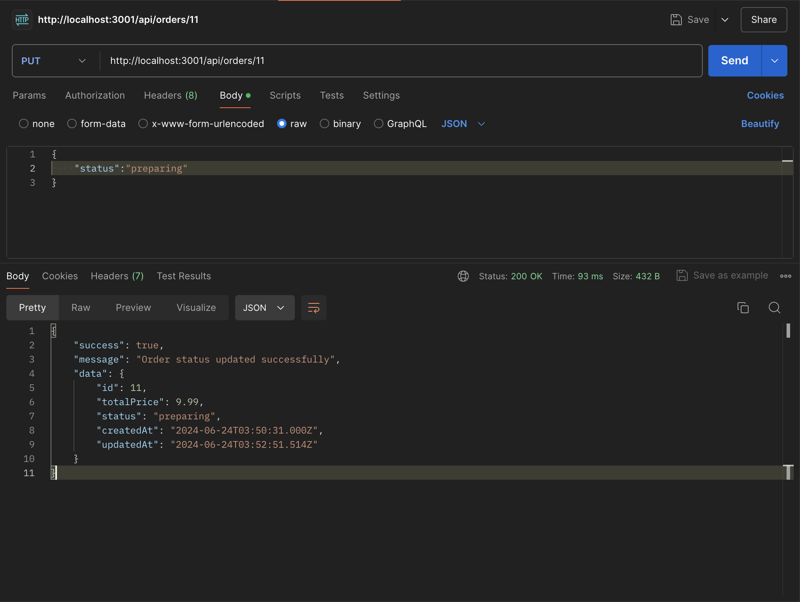

# Turing Tech Food Ordering System

This project is a Food Ordering System API.

## Table of Contents

1. [Installation](#installation)
2. [Docker Setup](#docker-setup)
3. [Database Migrations and Seeding](#database-migrations-and-seeding)
4. [Usage](#usage)
5. [API Endpoints](#api-endpoints)

## Installation

To set up the project locally, follow these steps:

1. Clone the repository:

   ```sh
   git clone https://github.com/jkc0de/turing-fos.git
   ```

2. Navigate to the project directory:

   ```sh
   cd turing-fos
   ```

3. Install the dependencies:

   ```sh
   npm install
   ```

4. Create a `.env` file in the root directory and add your environment variables:

   ```sh
   touch .env
   ```

   Example contents for `.env` can be found in the `.env.sample` file.

## Docker Setup

To set up the project using Docker:

1. Ensure you have Docker and Docker Compose installed.

2. Build and run the containers:

   ```sh
   docker-compose up --build
   ```

## Database Migrations and Seeding

To run the database migrations and seed the database:

1. Run the migrations:

   ```sh
   npx sequelize-cli db:migrate
   ```

2. Seed the database:

   ```sh
   npx sequelize-cli db:seed:all
   ```

## Usage

To start the development server:

1. Run the server:

   ```sh
   npm run dev
   ```

## API Endpoints

Here are the available API endpoints:

### GET /api/orders

Fetch all orders.

- **Response:**

  ```json
  {
    "success": true,
    "message": "Orders retrieved successfully",
    "data": [
      {
        "id": 1,
        "totalPrice": 10,
        "status": "delivered",
        "createdAt": "2024-06-21T10:05:55.000Z",
        "updatedAt": "2024-06-21T10:23:07.000Z",
        "orderItems": [
          {
            "id": 1,
            "quantity": 1,
            "createdAt": "2024-06-21T10:05:55.000Z",
            "updatedAt": "2024-06-21T10:05:55.000Z",
            "foodId": 1,
            "orderId": 1,
            "Food": {
              "id": 1,
              "itemName": "Pizza",
              "itemPrice": 9.99,
              "createdAt": "2024-06-21T10:04:21.000Z",
              "updatedAt": "2024-06-21T10:04:21.000Z"
            }
          }
        ]
      },
      {
        "id": 4,
        "totalPrice": 89.89,
        "status": "pending",
        "createdAt": "2024-06-21T10:10:37.000Z",
        "updatedAt": "2024-06-21T10:10:37.000Z",
        "orderItems": [
          {
            "id": 4,
            "quantity": 1,
            "createdAt": "2024-06-21T10:10:37.000Z",
            "updatedAt": "2024-06-21T10:10:37.000Z",
            "foodId": 1,
            "orderId": 4,
            "Food": {
              "id": 1,
              "itemName": "Pizza",
              "itemPrice": 9.99,
              "createdAt": "2024-06-21T10:04:21.000Z",
              "updatedAt": "2024-06-21T10:04:21.000Z"
            }
          },
          {
            "id": 5,
            "quantity": 10,
            "createdAt": "2024-06-21T10:10:37.000Z",
            "updatedAt": "2024-06-21T10:10:37.000Z",
            "foodId": 3,
            "orderId": 4,
            "Food": {
              "id": 3,
              "itemName": "Pasta",
              "itemPrice": 7.99,
              "createdAt": "2024-06-21T10:04:21.000Z",
              "updatedAt": "2024-06-21T10:04:21.000Z"
            }
          }
        ]
      }
    ]
  }
  ```

- **Screenshot:**
  

### POST /api/orders

Create a new order.

- **Request:**

  ```json
  {
    "items": [
      {
        "foodId": 1,
        "quantity": 1
      }
    ]
  }
  ```

- **Response:**

  ```json
  {
    "success": true,
    "message": "Order created successfully",
    "data": {
      "id": 6,
      "totalPrice": "9.99",
      "status": "pending",
      "updatedAt": "2024-06-24T03:50:31.805Z",
      "createdAt": "2024-06-24T03:50:31.805Z"
    }
  }
  ```

- **Screenshot:**
  

### PUT /api/orders/:id

Update an order's status.

- **Request:**

  ```json
  {
    "status": "preparing"
  }
  ```

- **Response:**

  ```json
  {
    "success": true,
    "message": "Order status updated successfully",
    "data": {
      "id": 6,
      "totalPrice": 9.99,
      "status": "preparing",
      "createdAt": "2024-06-24T03:50:31.000Z",
      "updatedAt": "2024-06-24T03:52:51.514Z"
    }
  }
  ```

- **Screenshot:**
  
